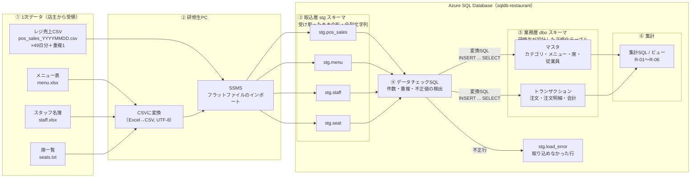

# データの流れ（1次データ → DB → 集計）

- 前提：`docs/requirements-story.md`（仮）の店主から 1次データを受け取る
- 前提：システム構成は `docs/system-architecture.md`（Azure SQL Database ＋ SSMS、App Service なし）

---

## 1. 全体図

## 2. 1次データの形式（講師が作成するダミーデータの仕様）

### 2.1 レジ売上 CSV（`pos_sales_20260801.csv` 〜）

UTF-8（BOM 付き）・CRLF。

レジが出力する**非正規化**データ。1行 = 伝票の1明細行。伝票の情報が明細行ごとに繰り返される。

| 列名 | 例 | 備考 |
|---|---|---|
| 伝票番号 | `20260901-0012` | 日付＋連番 |
| 明細番号 | `1` | 伝票内の連番。追加注文は同じ商品でも別行 |
| 来店日時 | `2026/09/01 12:03` | 日本時間の文字列 |
| 卓番 | `T3` / `C2` | T=テーブル、C=カウンター |
| 客数 | `2` | 伝票単位の値が全行に入る |
| 担当者 | `佐藤` | 姓のみ。空欄あり |
| 商品コード | `A001` | |
| 商品名 | `からあげ定食` | レジに登録された名称 |
| カテゴリ | `定食` | |
| 単価 | `950` | **注文時点の価格** |
| 数量 | `2` | 取消行はマイナス |
| 小計 | `1,900` | カンマ付き文字列 |
| 取消区分 | `0` / `1` | |
| 支払方法 | `現金` | 伝票単位の値が全行に入る |
| 伝票合計 | `2,850` | 同上 |

### 2.2 メニュー表（`menu.xlsx`）

店主の手管理。列：商品コード、商品名、カテゴリ、価格（現在）、旧価格、改定日、販売状況（販売中／終了）

### 2.3 スタッフ名簿（`staff.xlsx`）

列：スタッフNo、氏名（フルネーム）、雇用区分、入社日

### 2.4 席一覧（`seats.txt`）

1行1席：`T1,テーブル,4` の形式（卓番、種別、定員）

## 3. 各段階の処理

| 段階 | 処理 | 置き場所 | ポイント |
|---|---|---|---|
| ① 受領 | 店主からファイルを受け取る | 研修生 PC（**Git には入れない**。ダミーでも「顧客データは Git に入れない」習慣を付ける） | 受領ファイル一覧と件数を記録 |
| ② 変換 | Excel を UTF-8 の CSV に保存 | 研修生 PC | 文字コード（Shift_JIS / UTF-8）の違いで文字化けを体験する可能性あり |
| ③ 取込 | SSMS の「フラットファイルのインポート」で `stg` スキーマに入れる | DB `stg` スキーマ | **全列を文字列（NVARCHAR）で受ける**。ここで型変換すると不正行で取込自体が失敗し、どの行が悪いか分からなくなる |
| ④ チェック | 件数、重複、型変換できない値、マスタに存在しないコードを SQL で検出 | `sql/load/` | `TRY_CONVERT` で変換できない行を洗い出す。不正行は `stg.load_error` に退避 |
| ⑤ 変換・投入 | `INSERT ... SELECT` で正規化テーブルへ。伝票ヘッダと明細の分割、カンマ除去、型変換、マスタのコード変換 | DB `dbo` スキーマ。SQL は `sql/load/` で Git 管理 | 同じ伝票番号を2回投入しない仕組み（R-07）。投入後に件数・金額合計を stg と突合 |
| ⑥ 集計 | R-01〜R-06 の集計 SQL・ビュー | `sql/reports/` | 結果を手計算（または Excel）の値と突合してテストとする |

補足：Azure SQL Database では `BULK INSERT` に研修生 PC 上のファイルを直接指定できない（Azure Blob Storage 経由が必要）。そのため取込は SSMS のインポート機能で行う。Blob Storage はシステム構成を増やすため使わない。

## 4. 1次データに意図的に混ぜる不備（講師用・研修生には非公開）

④ チェックで研修生が自力で見つけられるかを評価する。

| # | 不備 | 発見に使う SQL / 観点 | 対応する要件 |
|---|---|---|---|
| D-01 | 9/1 以降、メニュー表の価格とレジ単価が一致しない商品が1件ある（店主がレジ側の修正を忘れた） | stg.pos_sales と stg.menu の単価比較 | R-03 |
| D-02 | 取消行（数量マイナス）がある | 取消区分・数量の分布確認 | R-01 |
| D-03 | 同じ日の CSV を店主が2回保存しており、同一伝票が重複している | 伝票番号＋商品コードでの重複検出 | R-07 |
| D-04 | 担当者が空欄の伝票がある | NULL / 空文字の件数 | R-06 |
| D-05 | メニュー表に存在しない商品コードがレジにある（期間限定メニュー） | 外部結合でマスタ不一致を検出 | R-02 |
| D-06 | スタッフ名簿はフルネーム、レジは姓のみ。同姓が2名いる | 結合キーの一意性確認 | R-06 |
| D-07 | 小計がカンマ付き文字列 | `TRY_CONVERT` の失敗 | R-01 |

不備は 7 件までにとどめる。これ以上増やすと W4〜W5 の期間内に終わらない可能性がある（研修生 1 名での所要時間は未検証）。

## 5. スケジュールへの影響

提案書の工程に対し、取込作業が追加される。

| 週 | 提案書の作業 | 追加される作業 |
|---|---|---|
| W1 | 要件整理 | ストーリーの読み込み、店主役へのヒアリング、1次データの中身の確認 |
| W2 | ER図・テーブル定義書 | 1次データの列と設計したテーブルの対応表（マッピング）作成 |
| W4–W5 | データ投入・SQL | ③〜⑤の取込・チェック・変換 SQL。**ここが最も工数が増える** |
| W6–W8 | テスト | 取込の件数・金額突合、二重取込しないことのテストを観点に追加 |

W4–W5 の 2 週間で取込と集計 SQL の両方が収まるかは未検証。収まらない場合は D-05〜D-07 を外すか、取込の一部（stg まで）を講師が用意する。

## 6. 講師が作成する必要があるもの

1. ダミーの 1次データ一式（2 章の形式、4 章の不備を含む）
2. 不備の正解一覧と、正しく取り込んだ場合の集計結果（R-01〜R-06 の正解値）
3. 店主役のヒアリング想定問答

## 7. 生成済みデータ

`tools/datagen/` のスクリプトで生成済み。手順・実データ（API）の扱いは `tools/datagen/README.md`。

| 置き場所 | 内容 | 研修生に渡すか |
|---|---|---|
| `data/source/` | 1次データ（レジ CSV 49 日分＋重複 1、menu.xlsx、staff.xlsx、seats.txt） | 渡す |
| `data/answer/` | 不備の該当伝票、R-01〜R-06 の正解値 | **渡さない** |
| `data/external/` | API で取得した天気・祝日（取得後に作成される） | 渡さない |
