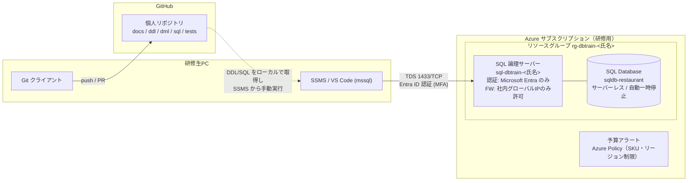

# 新人研修 DB構築課題 システム構成案（案1：小規模飲食店）

- 対象：Level 1（必須）〜 Level 2（発展：多店舗化等）
- 対象外：Level 3（画面・API・App Service / Static Web Apps 連携）。本構成には含めない
- 前提資料：「新入社員研修 DB構築課題 テーマ提案書」（研修期間 2026/11〜12）

---

## 1. 結論

新人1人あたりに作らせる構成は以下の3要素のみとする。

| 要素 | 採用 | 理由 |
|---|---|---|
| DB | **Azure SQL Database（論理サーバー＋単一DB、サーバーレス）** | 自動一時停止で放置時の課金を抑えられる。PostgreSQL Flexible Server には自動一時停止がない |
| 管理ツール | **SSMS**（または VS Code + mssql 拡張） | 提案書記載どおり。Azure Data Studio は提供終了済みのため採用しない |
| ソース管理 | **GitHub（1人1リポジトリ）** | 設計書・DDL・SQL・テスト結果を PR でレビューする |

App Service を使わないため、**DB に接続するのは研修生の PC（管理ツール）のみ**。アプリ用の接続文字列・シークレット管理・VNet 統合は不要となり、構成は「PC → インターネット → Azure SQL のパブリックエンドポイント（ファイアウォールで IP 制限）」の1経路に限定される。

確度：中（DB サービス選定は「コスト事故を防ぐ」を最優先した場合の結論。PostgreSQL を学ばせたい等の教育上の要求があれば結論は変わる）

---

## 2. 全体構成図



GitHub と Azure の間に自動連携（GitHub Actions によるデプロイ）は置かない。理由は 8 章。

---

## 3. Azure リソース構成

### 3.1 リソース分割方針

**1人1リソースグループ・1人1論理サーバー**とする。

- 根拠：研修ゴール「クラウド上に実際に作れる」を満たすには、論理サーバー作成・ファイアウォール・認証設定まで本人に操作させる必要がある。講師が共有サーバーを用意すると、この工程が抜ける
- 反証1：研修生が多いと無料オファー（後述）の上限 10 DB/サブスクリプションを超え、課金が発生する
- 反証2：権限設定ミスの調査対象がN倍になり、講師の負荷が増える
- **研修生は 11 名で確定**。Level 1 だけで 11 DB となり、無料オファーの上限 10 DB を 1 つ超える。Level 2 で DB を追加すればさらに超える
- 方針：**10 名分は無料オファー、残り（11人目および Level 2 の追加 DB）はサーバーレスの従量課金**とし、予算アラートで上限を管理する。サブスクリプションを分ける案は、管理（Policy・予算・RBAC）が2重になるため採らない
- 補足：どの研修生が無料枠から外れるかは講師が事前に決めておくこと（作成順で決まるため、放置すると最後に作った人が気づかず課金対象になる）
- 未確認：サーバーレス従量課金の単価（2026年10月時点の Japan East 価格は未確認）。自動一時停止 60 分を設定すれば、研修時間帯のみの稼働に限定されるが、金額の見積りは価格確認後に行う

### 3.2 命名・設定値（推奨値）

| リソース | 名前 | 主な設定 |
|---|---|---|
| リソースグループ | `rg-dbtrain-<氏名ローマ字>` | リージョン：Japan East。タグ `owner=<氏名>`, `purpose=training`, `expire=2026-12-31` |
| SQL 論理サーバー | `sql-dbtrain-<氏名ローマ字>` | Microsoft Entra のみ認証、Entra 管理者 = 本人、パブリックアクセス：選択したネットワークのみ、最小 TLS 1.2 |
| SQL Database | `sqldb-restaurant` | サーバーレス Gen5、最大 1〜2 vCore、自動一時停止 60 分、バックアップ冗長性 LRS、照合順序 `Japanese_XJIS_140_CI_AS` |
| SQL Database（Level 2） | `sqldb-restaurant-chain` 等 | 同上。Level 1 の DB は残し、別 DB として作る（設計変更前後を比較できるようにするため） |

### 3.3 作成時に決めないと後から変えにくい設定

研修生が気づかずにデフォルトで作ると後で困る項目。構築手順書で明示的に指示すること。

1. **照合順序**：既定値 `SQL_Latin1_General_CP1_CI_AS` のままだと日本語の並び順・比較が意図どおりにならない。DB 作成後の変更は手間が大きい
2. **タイムゾーン**：Azure SQL Database のサーバー時刻は UTC。`GETDATE()` は UTC を返す。**「日別売上」の集計で日付境界が9時間ずれる**。対処方針（JST で保存する／`datetimeoffset` で保存し `AT TIME ZONE 'Tokyo Standard Time'` で変換する）を設計レビューで論点にすること
3. **無料オファーの適用**：作成画面で適用しないと通常課金になる

### 3.4 無料オファー（要確認）

Azure SQL Database には、サブスクリプションあたり最大 10 DB、DB ごとに月 100,000 vCore 秒・32 GB までの無料オファーがある（2026年10月時点で最新条件は未検証）。上限到達時の動作は「翌月まで自動一時停止」を選ばせること（「継続して課金」を選ばせない）。

- 100,000 vCore 秒 ≒ 1 vCore で約 27.8 時間/月。研修中の実稼働時間がこれを超えるかは**利用状況次第で判断不能**。自動一時停止 60 分の設定と併せ、W3 の時点で使用量を確認すること
- 社内契約のサブスクリプションで本オファーが使えるかは、依頼者の認識では「問題ないはず」だが**実機未確認**。研修前に講師が1 DB を無料オファー付きで作成して確認すること

---

## 4. ネットワーク・認証

### 4.1 ネットワーク

| 項目 | 方針 |
|---|---|
| 接続経路 | パブリックエンドポイント（`<server>.database.windows.net:1433`） |
| ファイアウォール | 社内ネットワークのグローバル IP のみ許可。「Azure サービスおよびリソースにこのサーバーへのアクセスを許可する」は **OFF**（App Service を使わないため不要） |
| Private Endpoint / VNet | 使わない。Level 3 を実施しない限り必要性がない |

**Azure 上にサーバー（VM）は作らない**。SQL Database を作る際に作成する「論理サーバー」は VM ではなく、DB をまとめる管理単位（ファイアウォール・認証設定の置き場所）であり、作成自体に費用はかからない。省略はできない。

**最優先の確認事項**：社内プロキシ・FW が **TCP 1433 のアウトバウンドを許可しているか**。許可されていなければ研修生 PC から一切接続できず、W3 の構築工程が止まる。11月の研修開始前に講師が実機で接続確認すること。在宅研修がある場合は自宅 IP の扱いも決める必要がある。

### 4.2 認証・権限

| 対象 | Azure RBAC | DB 内の権限 |
|---|---|---|
| 研修生 | 自分のリソースグループの **共同作成者** のみ | Entra 管理者（= DB の全権） |
| 講師・レビュー担当 | サブスクリプションの 所有者 または 共同作成者 | 各 DB に Entra ユーザーとして `db_datareader` で追加（レビュー時に中身を確認するため） |

- SQL 認証（ユーザー名・パスワード）は無効化する。理由：パスワードを Git にコミットする事故を構造的に防げる
- 反証：社内 Entra ID のアカウントで SSMS から MFA 接続できない環境（条件付きアクセスで管理外端末を拒否する等）では接続できない。**テナントの条件付きアクセスポリシーは未確認**。不可の場合は SQL 認証に切り替え、パスワードは個人の資格情報マネージャーにのみ保存させる

### 4.3 Level 2 で追加する権限設計（任意）

提案書②の学習ポイント「店舗ごとの参照権限」を実体験させる場合、DB 内で以下を作る。Azure リソースの追加は不要。

- 包含データベースユーザー（Entra ユーザー、またはテスト用に `CREATE USER ... WITHOUT LOGIN`）
- 店舗担当ロール／本部ロールの作成と `GRANT`
- 必要に応じて行レベルセキュリティ（RLS）

---

## 5. GitHub リポジトリ構成

1人1リポジトリ（Organization 配下・Private）。講師がテンプレートリポジトリを用意し、研修生はそこから作成する。

```
restaurant-db/
├── README.md                  # 課題概要・接続先・実行手順
├── docs/
│   ├── requirements.md        # 要件整理（W1）
│   ├── er-diagram.md          # ER図（Mermaid 記法推奨：差分レビューが可能）
│   └── table-definitions.md   # テーブル定義書（W2）
├── ddl/
│   ├── 001_create_tables.sql
│   ├── 002_create_constraints.sql
│   └── 999_drop_all.sql       # 作り直し用
├── dml/
│   └── 001_seed_master.sql    # マスタ・ダミーデータ投入
├── sql/
│   └── reports/               # 日別売上・メニュー別売上などの集計SQL
└── tests/
    ├── test-plan.md           # テスト観点・テスト仕様書（W6）
    ├── cases/                 # テストケースごとの SQL
    │   └── TC001_negative_price_rejected.sql
    └── results/               # 実施結果の記録（W7〜W8）
```

### 5.1 運用ルール

- `main` への直接 push 禁止（ブランチ保護）。設計書・DDL・テストはすべて PR でレビュー
- マイルストーン（設計レビュー 11/13、構築レビュー 12/4）は PR のマージで判定する
- **接続情報（サーバー名を除く）・パスワード・個人情報をコミットしない**。Entra 認証にすることでパスワード自体が存在しない状態にする
- Excel 形式の設計書は差分が読めないため使わない（会社標準で Excel 指定がある場合は除く。その場合は PR レビューの効果が大きく下がる点を認識しておくこと）

---

## 6. 構築の流れ（研修生視点）

| 週 | 作業 | 使う場所 | 成果物 |
|---|---|---|---|
| W1–W2 | 要件整理・ER図・テーブル定義 | GitHub | `docs/` 一式（PR） |
| W3 | リソースグループ・論理サーバー・DB 作成、FW 設定、SSMS 接続 | Azure Portal / SSMS | 接続できたことのスクリーンショット、設定値を README に記録 |
| W3–W4 | DDL 作成・実行、作り直しの反復 | VS Code → SSMS | `ddl/`（PR） |
| W4–W5 | ダミーデータ投入、集計 SQL 作成 | SSMS | `dml/`, `sql/reports/`（PR） |
| W6–W8 | テスト観点・ケース作成、実施、結果記録 | SSMS / GitHub | `tests/`（PR）、結果報告 |
| 12/25 以降 | リソースグループ削除 | Azure Portal | 削除完了の報告 |

DDL は「GitHub 上のファイル = DB の実体」となるよう、**SSMS 上で直接テーブルをいじった変更は必ず `ddl/` に反映してからコミット**させる。`999_drop_all.sql` → `001`〜 の再実行で同じ DB が再現できることを構築レビューの合格条件にする。

---

## 7. テストの実施方式

追加ツール（tSQLt 等）は導入しない。理由：フレームワークの学習コストが本来の目的（観点の洗い出しと結果の説明）を上回る。

テストケース1件 = SQL ファイル1本とし、冒頭コメントに以下を書かせる。

```sql
-- TC001 価格に負数を登録できないこと
-- 観点  : ドメイン制約（CHECK 制約）
-- 前提  : メニュー「からあげ定食」が存在しない
-- 手順  : 価格 -100 で INSERT
-- 期待値: CHECK 制約違反エラー（メッセージ 547）で INSERT が失敗する
BEGIN TRANSACTION;
INSERT INTO menu (category_id, menu_name, price) VALUES (1, N'からあげ定食', -100);
ROLLBACK TRANSACTION;
```

- 実行結果（エラーメッセージ・件数・集計値）を `tests/results/` に記録し、期待値との一致／不一致を判定
- 集計テストは「手計算した期待値」と SQL 結果の突合とする（日付境界・返品なし・0件の日を含めること）
- `ROLLBACK` で後片付けする習慣を付けさせる

---

## 8. 意図的に採用しないもの

| 項目 | 不採用の理由 |
|---|---|
| App Service / Static Web Apps | 指示により対象外（Level 3） |
| GitHub Actions による DDL 自動デプロイ | OIDC フェデレーション・サービスプリンシパル権限の設定が必要で、研修目的（設計・SQL・テスト）に対して構築コストが大きい。手動実行の方が「どの順で何を流したか」を本人が理解できる |
| Bicep / Terraform（研修生側） | ポータル操作で各設定の意味を理解させる方を優先。講師側の Policy 配布等に使うのは可 |
| Private Endpoint / VNet | DB 単体構成では不要。費用と設定の複雑さが増える |
| Azure Database for PostgreSQL Flexible Server | 自動一時停止がなく、停止しても最大7日で自動起動する。止め忘れ時の課金リスクが SQL Database サーバーレスより高い |

---

## 9. 講師側で事前に用意するもの

1. 研修用サブスクリプション（本番と分離）
2. 予算アラート（サブスクリプション単位、例：月額上限の 50% / 80% / 100% で通知）
3. Azure Policy
   - 許可リージョン：Japan East のみ
   - 許可リソースの種類：SQL サーバー / SQL Database のみ
   - SQL Database の SKU 制限（サーバーレスまたは低 DTU のみ。vCore プロビジョニングの高 SKU 誤作成を防ぐ）
   - 必須タグ：`owner`, `expire`
4. 研修生への RBAC 付与（自分の RG の共同作成者。RG は講師が先に作るか、作成権限を付与するかを決める）
5. GitHub Organization とテンプレートリポジトリ、ブランチ保護設定
6. 社内ネットワークからの 1433/TCP 接続と Entra MFA 接続の実機確認
7. 研修終了時の削除手順と期限（タグ `expire` を使って残存リソースを抽出）

---

## 10. 確認状況

### 10.1 確定事項

| 項目 | 内容 | 構成への反映 |
|---|---|---|
| 研修生の人数 | 11 名 | 3.1 参照。10 名分は無料オファー、1 名＋Level 2 追加分は従量課金 |
| 課題の形態 | ほぼ個人課題 | 1人1RG・1人1リポジトリを維持。チーム課題を部分的に行う場合はその課題だけ共有リポジトリを作る |
| Azure 上の VM | 作らない | 論理サーバー（VM ではない）のみ作成 |

### 10.2 未確認事項（結論に影響するもの）

| # | 項目 | 影響 | 確認方法 |
|---|---|---|---|
| 1 | 社内 NW から 1433/TCP のアウトバウンド可否 | 不可なら構成自体が成立しない。代替は Azure Portal のクエリエディター（機能制限あり）か、Azure 上の踏み台 VM（費用・構成増） | 講師が研修生と同じ社内端末・NW から SSMS で接続試験 |
| 2 | テナントの条件付きアクセス・研修用 Entra アカウントの有無 | Entra 認証が使えなければ SQL 認証へ切り替え | 1 と同時に、研修生と同条件のアカウントで MFA 接続試験 |
| 3 | 社内契約サブスクリプションでの無料オファー適用可否 | 不可なら 11 DB 全てが従量課金 | 講師が1 DB を無料オファー付きで作成 |
| 4 | 無料オファーの最新条件・サーバーレス単価 | 費用見積りの前提 | Microsoft Learn・Azure 料金計算ツールで確認 |
| 5 | 会社標準の設計書形式（Excel 指定の有無） | GitHub での差分レビューの有効性が変わる | 研修責任者に確認 |

1〜3 は同じ日に1回の作業で確認できる。研修開始（11/2）の前に実施すること。
